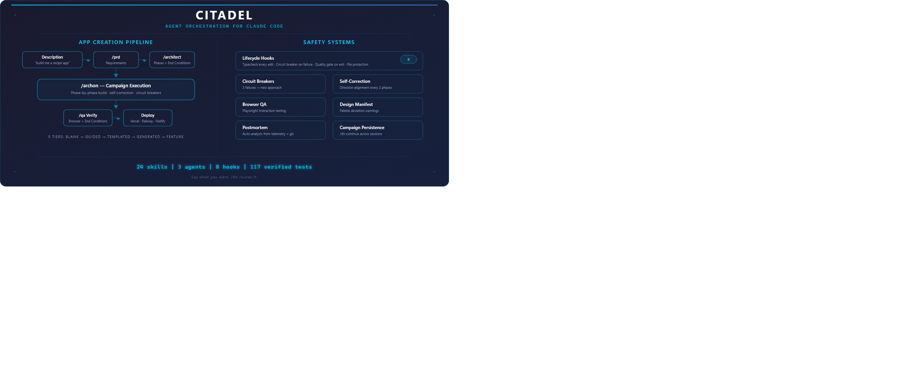
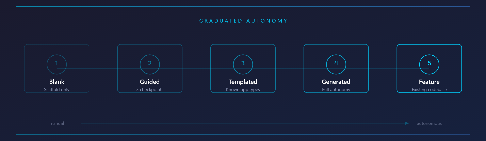
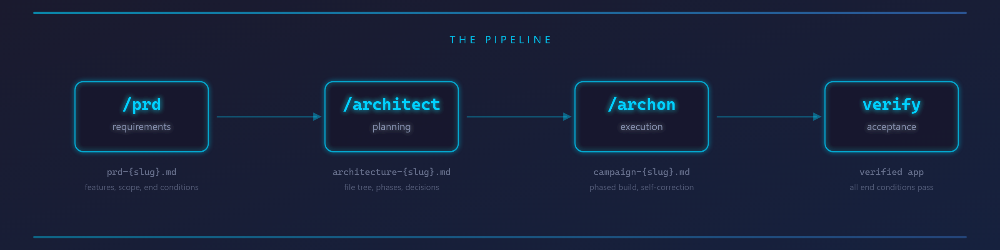
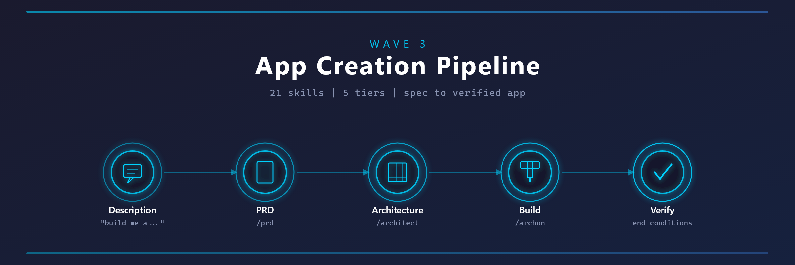
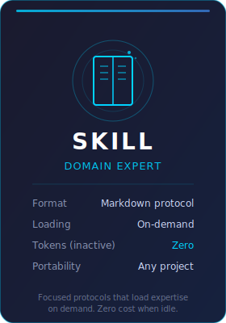
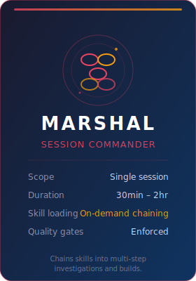
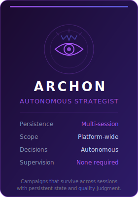
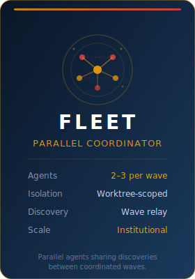

# Citadel — Documentation

Visual documentation of the agent orchestration harness.

## System Overview

The full orchestration system: intent routing, app creation pipeline, quality gates, and safety systems.

## Orchestration Tiers

The orchestration ladder: Skills → Marshal → Archon → Fleet.

## Pipeline

App creation pipeline flow from PRD through architecture to phased build.

## Fleet Parallelism

Wave-based parallel execution with discovery relay between agents.

## Agent Cards

| Agent | Card |
|-------|------|
| Skill |  |
| Marshal |  |
| Archon |  |
| Fleet |  |
